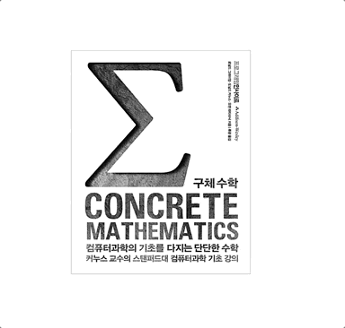

# box-spinner
>oh box!<br>
>Look at the box shape in detail.


## option

```js
{
  width: `${type width of box}px`,
  height: `${type height of box}px`,
  depth: `${type depth of box}px`,
  front: `${image url}`,
  back: `${image url}`,
  left: `${image url}`,
  right: `${image url}`,
  top: `${image url}`,
  bottom: `${image url}`
}
```

## api
```typescript

function push(Element: HTMLElement): BoxSpinner;
function rotate(horizontal: number, vertical: number): BoxSpinner;

```
## DEMO



```js
  // index.html
  document.addEventListener('DOMContentLoaded', () => {
    window.bs = new boxSpinner({
      front: './asset/img/front.jpg',
      back: './asset/img/back.jpg',
      width: "200px",
      height: "250px",
      depth: "50px",
    }).push(document.body.querySelector('#container'));
  });
```